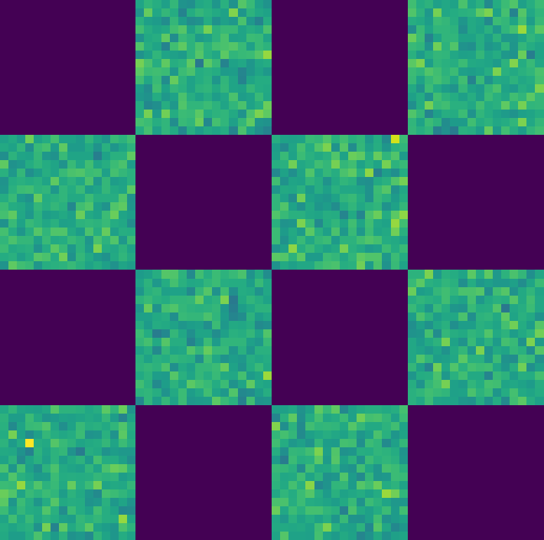

# Description

In this project, we attempt to create a generative model for discrete data.

# Generative Models on Various Datasets

Various generative models on 2D toy datasets, *continuous* and *discretized*.

     

     

## Quick Start

This code depends on the `survae` library, which is available at https://github.com/didriknielsen/survae_flows.


#### Dataset
Plot a dataset using
```shell
python plot_data.py --dataset two_spirals
```
Some available datasets are e.g.:
  * `text8`
  * `two_spirals`
  * `four_circles`
  * `checkerboard`
  * `two_moons`
  * `diamond`

#### Model
Train a model using
```shell
python train.py --dataset two_spirals --model flow
```
Some available models are e.g.:
  * `flow`
  * `gan`

Further arguments can be specified depending on the dataset/model.

## Guide

<details>
  <summary>Plotting a dataset</summary>

To plot dataset `DATASET_NAME`, you can use:
```
python plot_data.py --dataset DATASET_NAME
```

</details>

<details>
  <summary>Training a model</summary>

To train model `MODEL_NAME` on dataset `DATASET_NAME`, you can use:
```
python train.py --model MODEL_NAME --dataset DATASET_NAME --name RUN_NAME
```
Records of the run will be stored in `results/{DATASET_NAME}/{MODEL_NAME}_{RUN_NAME}`.
</details>

<details>
  <summary>Adding a new dataset</summary>

1. Implement the usual `torch.utils.data.Dataset` in `data/datasets.py`.
1. Add an entry to `data/factory.py` with name `DATASET_NAME`.

</details>

<details>
  <summary>Adding a new model</summary>

1. Implement the usual `nn.Module` in the folder `models/MODEL_NAME`.
1. Add an entry to `models/factory.py` with name `MODEL_NAME`.
</details>
